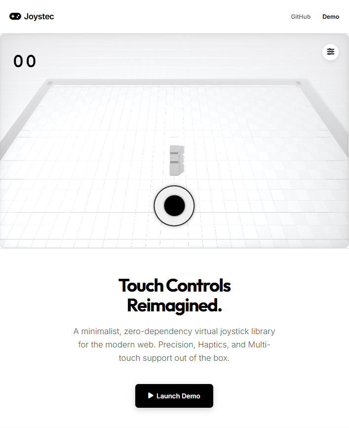

<div align="center">

# Virtual Joystick (Joystec)

[](https://opensource.org/licenses/MIT)
[](https://github.com/blaxezcode/Virtual-Joystick)
[]()

<br />

**A lightweight, zero-dependency virtual joystick library for the modern web.**  
_Built with precision, haptics, and aesthetics in mind._

</div>

---

## ◈ Features

- **Zero Dependencies**: Pure Vanilla JS. No frameworks required.
- **Lightweight**: Under 5KB gzipped.
- **Multi-Touch Support**: Works specifically for mobile interactions.
- **Haptic Feedback**: Built-in Vibration API support for tactile feel.
- **Fully Customizable**: Control size, colors, sensitivity, and zones.
- **Multiple Modes**:
  - **Static**: Fixed position on screen.
  - **Dynamic**: Appears wherever you touch.
- **Keyboard Emulation**: Map joystick direction to Arrow keys or WASD.
- **Smart Constraints**: Circular, Square, and Axis-Locked movement.

## ➜ Installation

### Option 1: Direct Download

Download the `src/virtual-joystick.js` file and include it in your project.

### Option 2: Clone Repository

```bash
git clone https://github.com/blaxezcode/Virtual-Joystick.git
```

## ⚡ Usage

### 1. HTML Structure

Create a container for your joystick.

```html
<div
  id="joystick-zone"
  style="width: 100%; height: 100vh; position: relative;"
></div>
```

### 2. Basic Initialization

```javascript
import VirtualJoystick from "./src/virtual-joystick.js";

const container = document.getElementById("joystick-zone");

const joystick = new VirtualJoystick(container, {
  width: 150,
  height: 150,
  color: "#ffffff",
  handleColor: "#000000",
  onChange: (data) => {
    console.log(`DX: ${data.delta.x}, DY: ${data.delta.y}`);
  },
});
```

### 3. Advanced Configuration

```javascript
const joystick = new VirtualJoystick(container, {
  mode: "dynamic", // 'static' or 'dynamic'
  maxMoveRadius: 75, // Limit effective travel distance
  lockAxis: "x", // 'x', 'y' or null
  haptics: true, // Vibration feedback
  sensitivity: 1.2, // Input multiplier
  zones: [
    // Custom haptic zones
    { id: "run", min: 0.8, max: 1.0, color: "rgba(255,0,0,0.2)" },
  ],
});
```

## ≡ API Documentation

### `new VirtualJoystick(container, options)`

| Option          | Type     | Default    | Description                                      |
| :-------------- | :------- | :--------- | :----------------------------------------------- |
| `width`         | `number` | `100`      | Width of the joystick base (px)                  |
| `height`        | `number` | `100`      | Height of the joystick base (px)                 |
| `handleRadius`  | `number` | `20`       | Radius of the inner handle (px)                  |
| `maxMoveRadius` | `number` | `null`     | Limit handle movement range (px)                 |
| `color`         | `string` | `gray`     | Background color of base                         |
| `handleColor`   | `string` | `white`    | Color of the handle                              |
| `mode`          | `string` | `'static'` | `'static'` (fixed) or `'dynamic'` (touch-follow) |
| `lockAxis`      | `string` | `null`     | Lock movement to `'x'` or `'y'` axis             |

### Methods

- **`joystick.destroy()`**: Removes the joystick and event listeners.
- **`joystick.setOption(key, value)`**: Update settings in real-time.

## ⚛ Embedding (Game Example)

The library integrates seamlessly with HTML5 Canvas games.
_(The image below represents the included demo game "Raytraced Voxel Snake")_



## © License

This project is licensed under the MIT License - see the LICENSE file for details.

---

Created by **@blaxezcode**
